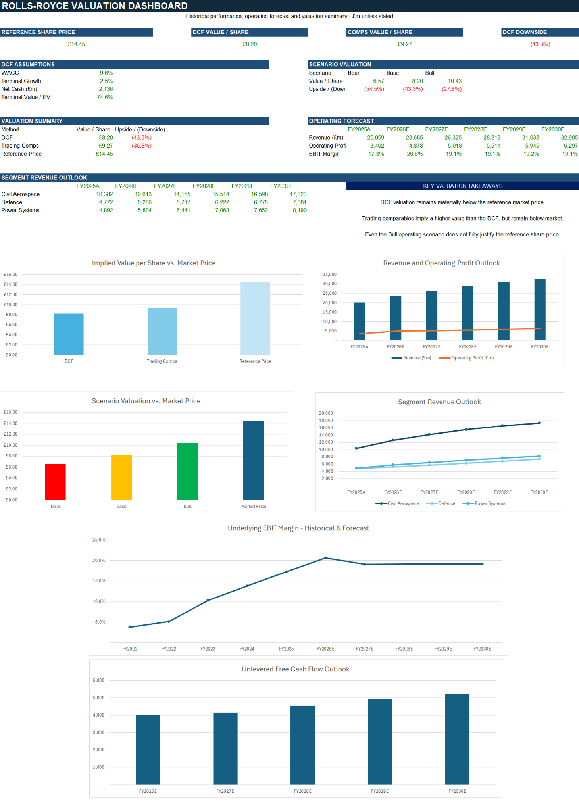
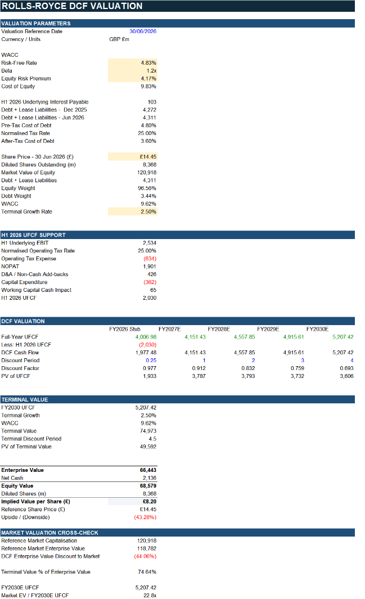
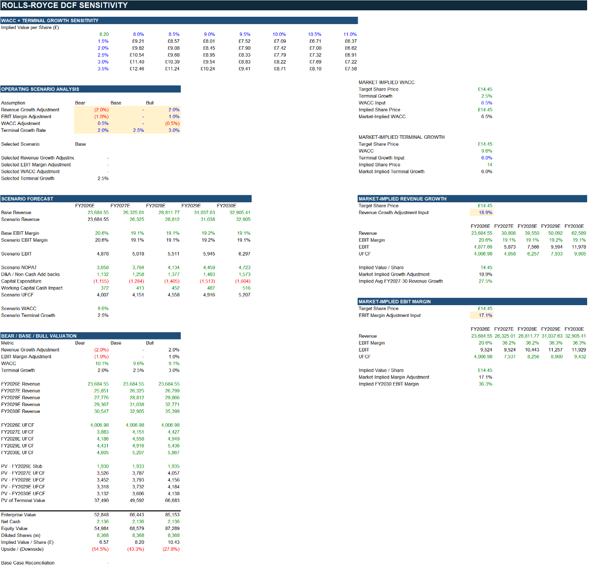
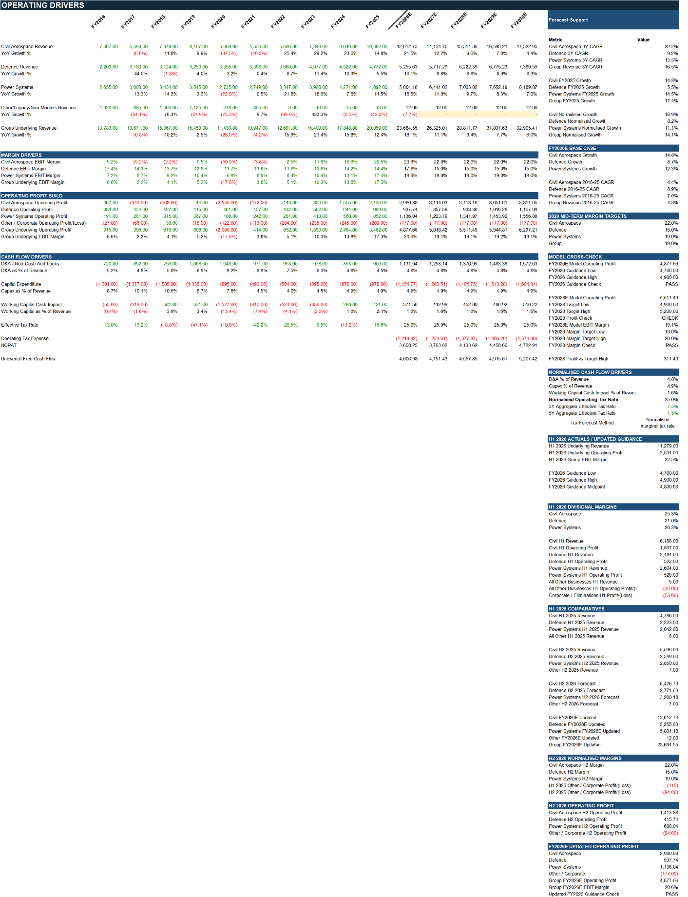

# Rolls-Royce Financial Model & Valuation

A fully linked Excel valuation model for Rolls-Royce Holdings plc covering historical financial analysis, segment operating drivers, a FY2026E-FY2030E forecast, discounted cash flow valuation, trading comparables, sensitivity analysis, scenario valuation, Power Query and model-integrity checks.

## Project objective

The model is designed to answer three linked questions:

1. What operating assumptions are required to translate recent Rolls-Royce performance into a five-year forecast?
2. What value does that forecast imply under a DCF and peer-multiple framework?
3. How sensitive is the conclusion to revenue growth, EBIT margins, WACC and terminal growth?

## Data and model structure

Historical financial statements cover FY2016-FY2025, with the forecast extending to FY2030E. The workbook combines manual historical/model inputs with Power Query connections including:

- `PQ_Income_Statement`
- `PQ_Balance_Sheet`
- `PQ_Cash_Flow`
- `PQ_Fact_Financials`
- `CH_Accounts_Filing_History`
- `CH_Accounts_Document_Metadata`
- `Dim_Concept`
- `Dim_Period`

The `Sources` sheet documents annual reports, FY2025 results, H1 2026 results, Companies House metadata, market-price inputs, UK government bond yield, equity risk premium and peer-company inputs.

## Cached valuation conclusion

The dashboard's saved base case reports:

| Metric | Cached value |
|---|---:|
| Reference share price | **£14.45** |
| DCF value / share | **£8.20** |
| DCF downside | **-43.3%** |
| Trading-comps midpoint | **£9.27** |
| Comps downside | **-35.8%** |
| Bear scenario | **£6.57/share** |
| Base scenario | **£8.20/share** |
| Bull scenario | **£10.43/share** |

Even the saved Bull scenario remains below the £14.45 reference price. The model therefore concludes that the market price embeds a more demanding operating outcome than the explicit base forecast.

## Forecast profile

Group underlying revenue increases from **£20.1bn in FY2025A to £32.9bn in FY2030E**, equivalent to roughly a **10.4% five-year CAGR**. The model forecasts a step-up in underlying EBIT margin from **17.3% in FY2025A to 20.6% in FY2026E**, then settles around **19.1%** through FY2030E.

Unlevered free cash flow rises from approximately **£4.01bn in FY2026E** to **£5.21bn in FY2030E**.

## DCF assumptions

The saved DCF uses:

| Assumption | Value |
|---|---:|
| Risk-free rate | 4.83% |
| Beta | 1.20x |
| Equity risk premium | 4.17% |
| Cost of equity | 9.83% |
| After-tax cost of debt | 3.60% |
| WACC | **9.62%** |
| Terminal growth | **2.50%** |
| Net cash | **£2,136m** |
| Diluted shares | **8,368m** |

The terminal value represents about **74.6% of enterprise value**, so the sensitivity analysis is an important part of the model rather than an optional extra.

## Workbook structure

| Worksheet | Role |
|---|---|
| `README` | Start-here guide |
| `Dashboard` | Valuation and forecast summary |
| `Historical_FS` | Historical income statement, cash flow, balance sheet and segment data |
| `Ratio_Analysis` | Historical operating and financial ratios |
| `Operating_Drivers` | Segment growth, margins and forecast assumptions |
| `Forecast_Model` | FY2026E-FY2030E group and segment forecast |
| `DCF` | WACC, UFCF, terminal value and implied value/share |
| `Comparable_Companies` | Peer multiples and implied valuation |
| `Sensitivity` | WACC/growth and Bear/Base/Bull analysis |
| `Power_Pivot_Analysis` | Data Model analysis |
| `Checks` | Model reconciliation and integrity controls |
| `Sources` | Source register and methodology |
| `Raw_Data` | Power Query / source extracts |

## Dashboard walkthrough

### DCF

### Sensitivity and scenario valuation

### Operating drivers

## Model controls

The `Checks` sheet contains reconciliation tests for forecast revenue, forecast operating profit, WACC capital weights, DCF enterprise/equity/per-share value, sensitivity base case, scenario base case, comparable-company links, net cash and segment revenue. The cached overall model status is **PASS**.

See [Formula, Query & Model Guide](docs/FORMULA_GUIDE.md), [Workbook Architecture](docs/WORKBOOK_ARCHITECTURE.md) and [Data Sources](docs/DATA_SOURCES.md).

## Files

- [`workbook/Rolls_Royce_Financial_Model_Portfolio.xlsx`](workbook/Rolls_Royce_Financial_Model_Portfolio.xlsx) - cached portfolio workbook
- [`docs/Rolls_Royce_Project_Summary.pdf`](docs/Rolls_Royce_Project_Summary.pdf) - 3-page valuation summary
- [`docs/FORMULA_GUIDE.md`](docs/FORMULA_GUIDE.md) - forecast, DCF, comps and sensitivity logic
- [`docs/WORKBOOK_ARCHITECTURE.md`](docs/WORKBOOK_ARCHITECTURE.md) - model flow and worksheet roles
- [`docs/DATA_SOURCES.md`](docs/DATA_SOURCES.md) - source register and data-refresh notes

## Limitations

- This is an analytical valuation model, not investment advice.
- The DCF is highly sensitive to terminal assumptions and long-term margins.
- Peer multiples depend on company selection, metric definitions and market prices.
- Forecasts rely on explicit assumptions about segment growth, margin normalisation and cash conversion.
- `STOCKHISTORY` and Power Query links may require Excel connectivity to refresh; the portfolio workbook therefore retains cached values for review.
- Market prices and valuation inputs are dated and should not be treated as current beyond the stated valuation date.

**Tools demonstrated:** Excel 365, financial modelling, Power Query, Power Pivot, DCF valuation, trading comparables, sensitivity tables, scenario analysis, structured checks and dashboard design.